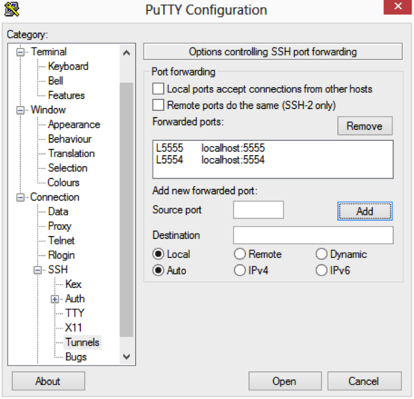

# Prepare the Remote Machine

1. Install and enable an SSH server solution.

   - On a Windows host, Windows lacks built-in SSH support, you can install [FreeSSHd](http://www.freesshd.com/) that has been found to work.
   - On Mac OS X go to System Preferences -> Sharing and enable "Remote Login".

2. Install the Android SDK (not the ADT bundle) on the host (Set Intel x86 Emulator Accelerator).

3. Create and start an Android emulator (With use Host GPU enabled).

4. Kill the ADB server:

   1) Open a terminal window and navigate to the Android SDK folder that contains the ADB executable (sdk\platform-tools directory).
   2) Enter: adb.exe kill-server (Windows) or ./adb kill-server (Mac OS X, Linux).

# Configure the Development PC

1. Install the [PuTTY](http://www.chiark.greenend.org.uk/~sgtatham/putty/download.html) SSH client.
2. Open PuTTY and create a connection to your remote machine.
3. Select Connection > SSH > Tunnels and add a local/auto port forwarding for:
   - 5555 to localhost:5555
   - 5554 to localhost:5554

   

4. Save your connection and open it.
5. Enter the SSH login credentials for your remote machine.
6. Keep this terminal window open as it maintains the connection to the remote machine. You can minimize it.

Once you are logged in, you need to restart the ADB server running on your development PC:
  - Open a terminal window and navigate to the Android SDK folder that contains the ADB executable (sdk\platform-tools directory).
  - Enter:  adb.exe kill-server&adb start-server

Your Android emulator running on the remote machine should now appear on the Device Manager.

Note: Android emulators installed in your remote machine but not running cannot be displayed on the Device Manager; only running emulators are displayed.

# Reference

 - [Debugging Against a Remote Android Emulator](http://delphi.org/2013/09/debugging-against-a-remote-android-emulator/)
 - [Running and Debugging Your Android Application Remotely](http://docwiki.appmethod.com/appmethod/1.14/topics/en/Running_and_Debugging_Your_Android_Application_Remotely)
